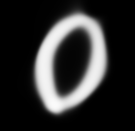
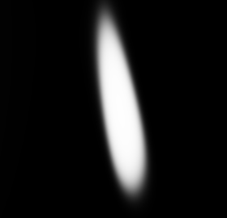
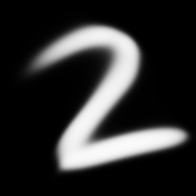
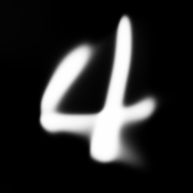
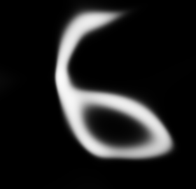
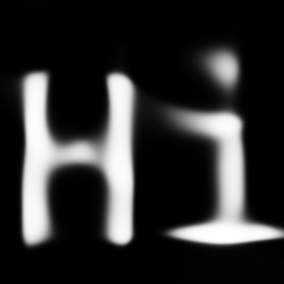
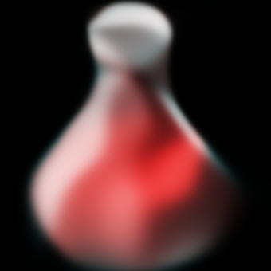
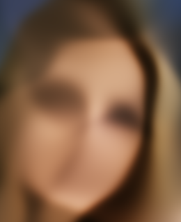
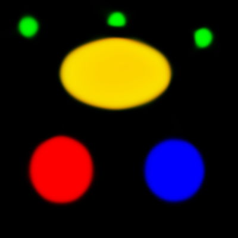

# Neural Network Experiments

## xor

Simple network that can XOR 2 bits.

## adder

Simple network that can add two 4 bit numbers.

## img_nn

Network that can _learn_ an image and generated an upscaled version.

### Examples

 -> 

 -> 

 -> 

 -> 

 -> 

 -> 

 -> 

 -> 

 -> 

 -> 

 ->  

 -> 

 -> 

 -> 

 -> 

 -> 

 -> 

 -> 

 -> 

 -> 

(input images shown here were resized for clarity)
